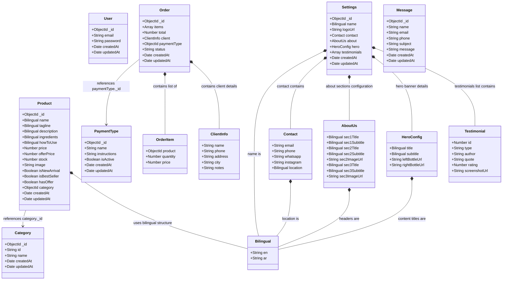

# HE Skincare E-Commerce Platform

A premium, production-ready Headless E-Commerce & Content Management System (CMS) custom-designed for luxury skincare rituals. The platform features a customer-facing storefront, an advanced administrative dashboard, a secure REST API backend, and automated WhatsApp notifications.

## 🚀 Live Production Links
- 🛒 **Customer Storefront:** [https://skin-care-react-project.vercel.app](https://skin-care-react-project.vercel.app)
- ⚙️ **Admin Dashboard:** [https://skin-care-react-project-h8cw.vercel.app](https://skin-care-react-project-h8cw.vercel.app)
- 📡 **Production API Backend (Railway):** [https://skincarereactproject-production.up.railway.app](https://skincarereactproject-production.up.railway.app)

### 🔒 Demo Sandbox Login Credentials
To safely explore the Admin Dashboard, use the following credentials:
* **Email:** `demo@skincareproject.com`
* **Password:** `demo1234`
*(Note: Database writes/modifications are disabled when logged in under the demo sandbox account).*

> [!NOTE]
> This project is the first task completed during training at **CodeAlpha**. It has been successfully moved to production for a real client, with all features, payment instructions, bilingual structures, and WhatsApp automation gateways tailored to the client's specifications.

---

## 🏛️ Project Directory Structure & Connections

To navigate between different areas of the platform, refer to these specialized documents:
- 🌐 **[Root System Documentation](./README.md)** (This document)
- 📡 **[Backend Engine Specifications](./Backend/README.md)** — Core Rest API structure, schemas, and models.
- 🎨 **[Frontend User Interfaces](./Frontend/README.md)** — Storefront and admin control dashboard specs.
- 🚀 **[CI/CD Pipelines Manual](./.github/workflows/README.md)** — GitHub Actions parallel testing runner details.

```
SkinCareProject/
├── .github/workflows/          # CI/CD Workflows
│   └── README.md               # ◄— CI/CD Pipeline Manual
├── Backend/                    # Express.js REST API
│   ├── README.md               # ◄— Backend Engine Specifications
│   ├── API_README.md           # ◄— REST API Reference Endpoint Manual
│   └── TESTING_README.md       # ◄— Backend Testing Documentation
├── Frontend/                   # Storefront & Admin Apps
│   └── README.md               # ◄— Frontend User Interfaces Specs
└── README.md                   # ◄— Root System Documentation (This file)
```

---

## 🔒 Security & Hybrid Authentication Architecture

The system implements a robust hybrid security structure that combines stateless tokens and stateful sessions to provide the highest level of security:

### 1. Hybrid Auth Engine
- **Stateless JWT Tokens:** Provides lightweight, short-lived JSON Web Tokens for API requests.
- **Stateful Sessions:** Implements `express-session` with session stores persisted directly in MongoDB via `connect-mongo`.
- **Token Invalidation & Blacklisting:** Revokes old tokens when logging out or calling the refresh endpoint. Revoked tokens are saved in a `BlacklistedToken` Mongoose model and automatically cleared using a MongoDB TTL index set to expire after 12 hours.
- **Token Refresh Endpoint (`/api/auth/refresh`):** Extends the session cookie lifetime, revokes the old JWT token, and returns a new signed token.

### 2. Infrastructure Protections
- **Credential Encryption:** Encrypted passwords using `bcryptjs` with salt rounds.
- **Access Protections:** Custom authentication guards (`protect`) secure admin-only routes.
- **Rate Limiters:** Defends against brute-force login and spam attacks using `express-rate-limit`.
- **Validation guards:** Custom schemas via `express-validator` sanitize input payloads.

---

## 💾 Database Schema Design (Bilingual Architecture)

The system supports real-time multi-language rendering by utilizing **Bilingual Schema Sub-documents** for textual data.



---

## 📡 WhatsApp Gateway & persistent session volume
The automated notification bridge is powered by `whatsapp-web.js` running inside a headless browser container:
- **Persistent Railway Volume:** Auth credentials are saved inside `/app/whatsapp_session` which is bound to a persistent **Railway Volume** to prevent session loss upon Docker container rebuilds.
- **Singleton Lock Cleanup:** On startup, the server uses `lstatSync` and `unlinkSync` to clear stale Chromium singleton lock files (`SingletonLock`, `SingletonCookie`, `SingletonSocket`) to prevent initialization freezes.
- **Client Dispatches:** Automatically sends order details and notifications to the store owner's WhatsApp when an order is placed, and allows admins to message customers from the Dashboard.

---

## 🎨 Frontend Design & Optimizations
- **Styling Tech:** Built with **Tailwind CSS** utility classes and custom **Vanilla CSS** branding variables.
- **Performance Optimizations:** Implements image lazy-loading (`loading="lazy"`) and optimized React state context pipelines.
- **Form Validations:** Admin forms contain real-time validation checks with **luminous bright red borders (`#ff3333`)** and glowing focus shadows.
- **Theming & Localization:** Supports full Dark/Light modes and English/Arabic translation switchers.

---

## 🧪 Comprehensive Multi-Tier Testing Suite
- **Backend API Tests (Jest & Supertest):** Integration tests under `Backend/tests`.
- **Frontend Component Tests (Vitest):** Component unit testing under `WebPage` and `Dashboard`.
- **End-to-End Testing (Cypress):** Simulated user-flows for dashboard catalog management.

For details on the CI/CD pipeline, please refer to [**`workflows/README.md`**](./.github/workflows/README.md).
